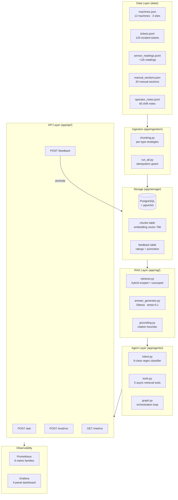
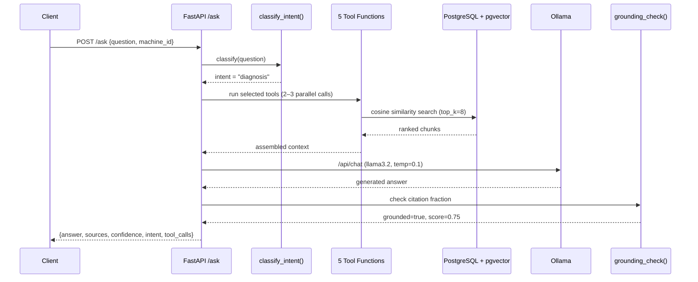

# Operational AI Copilot

Production-grade RAG + agentic AI system for industrial operations — with evaluation, observability, and human-in-the-loop feedback.

[](https://github.com/sylvainbonnot/operational-ai-copilot/actions/workflows/ci.yml)
[](#evaluation-results)
[](#evaluation-results)
[](#testing)

---

## Why this matters

Industrial AI systems fail when they are not grounded, observable, or operationally integrated.
A chatbot that hallucinates a root cause, or an LLM that ignores the maintenance manual, is worse than no AI at all.

This project demonstrates how to build a **reliable AI copilot** over machine data, maintenance history, and operational knowledge — with every design decision oriented toward correctness, traceability, and measurability.

---

## Features

| Capability | Implementation |
|---|---|
| RAG over manuals and incident tickets | pgvector + nomic-embed-text embeddings |
| Intent-driven agent workflows | Custom orchestrator — 6 intents, 5 tools |
| Synthetic industrial dataset | 12 machines, 120 tickets, ~12k sensor readings |
| Grounded answers with source citations | Heuristic + LLM-ready grounding check |
| Evaluation framework | 20 golden questions, evidence hit rate, CI gate |
| Prometheus / Grafana observability | 9 metric families, auto-provisioned dashboard |
| Human-in-the-loop feedback | `/feedback` API → golden dataset promotion |
| Dockerised deployment | One-command `make up` |

---

## Architecture

The system is a layered RAG pipeline with an intent-driven agent on top. Every layer is independently testable and replaceable.



### Request flow: POST /ask



---

## Tech stack

| Layer | Technology | Why |
|---|---|---|
| Backend | Python 3.11 · FastAPI · Pydantic v2 | Async, typed, validated |
| AI — Generation | Ollama · llama3.2 | Fully local, no API cost |
| AI — Embeddings | Ollama · nomic-embed-text (dim=768) | Deterministic, reproducible |
| Storage | PostgreSQL 16 + pgvector | One DB for vectors + feedback |
| Vector index | IVFFlat · lists=50 | Right-sized for ~250 vectors |
| Async ORM | SQLAlchemy (async) · asyncpg | Non-blocking DB queries |
| Observability | Prometheus · Grafana · structlog | Production-grade metrics |
| Dependency mgmt | uv | 10–100× faster than pip |
| CI | GitHub Actions · pytest · mypy · ruff | Lint + type + test + eval gate |

---

## Evaluation results

Run against **20 golden questions** covering diagnosis, procedure lookup, anomaly analysis, and adversarial refusal (q_019 asks about Mars rover maintenance — correctly answered with refusal).

### Summary

| Metric | Score | Threshold |
|---|---:|---:|
| Pass Rate | **100%** (20/20) | ≥ 60% |
| Mean Evidence Hit Rate@8 | **1.00** | ≥ 0.50 |
| Mean Recall@8 | **1.00** | — |
| Mean Groundedness | **0.23** † | — |
| Mean Latency | **42 s** ‡ | — |
| Total tokens (20 runs) | 22,527 | — |

† Heuristic citation-fraction score (not semantic NLI). Higher values indicate the LLM cited its sources more densely.  
‡ Ollama on CPU. GPU or hosted inference → ~2–3 s.

### Per-question breakdown

| ID | Question (truncated) | Hit Rate | Recall | Groundedness | Latency |
|----|----------------------|:--------:|:------:|:------------:|--------:|
| q_001 | Bearing inspection interval for compressor | 1.00 | 1.00 | 0.12 | 59.6 s |
| q_002 | Compressor_17 pressure failure cause | 1.00 | 1.00 | 0.75 | 41.0 s |
| q_003 | Compressor seal replacement steps | 1.00 | 1.00 | 0.12 | 40.9 s |
| q_004 | Vibration alarm operator procedure | 1.00 | 1.00 | 0.12 | 42.2 s |
| q_005 | Pump cavitation causes and diagnosis | 1.00 | 1.00 | 0.50 | 47.6 s |
| q_006 | Vibration severity zones ISO 10816 | 1.00 | 1.00 | 0.12 | 41.7 s |
| q_007 | Recent anomalies on compressor_17 | 1.00 | 1.00 | 0.25 | 46.2 s |
| q_008 | Lockout tagout safety procedure | 1.00 | 1.00 | 0.12 | 47.9 s |
| q_009 | Rolling element bearing relubrication freq | 1.00 | 1.00 | 0.12 | 49.1 s |
| q_010 | Boiler heat exchanger descaling procedure | 1.00 | 1.00 | 0.25 | 47.7 s |
| q_011 | Recent failures on pump | 1.00 | 1.00 | 0.75 | 57.4 s |
| q_012 | Burner ignition fault diagnosis on boiler | 1.00 | 1.00 | 0.38 | 53.0 s |
| q_013 | Belt tension check procedure for conveyor | 1.00 | 1.00 | 0.12 | 38.3 s |
| q_014 | Vibration freq signatures for bearing fault | 1.00 | 1.00 | 0.12 | 43.0 s |
| q_015 | Cooling system flow requirement | 1.00 | 1.00 | 0.12 | 27.1 s |
| q_016 | Turbine bearing temperature alarm limits | 1.00 | 1.00 | 0.12 | 22.1 s |
| q_017 | Why compressor_17 overheats + remediation | 1.00 | 1.00 | 0.12 | 36.3 s |
| q_018 | Grease specification for rolling elements | 1.00 | 1.00 | 0.12 | 36.8 s |
| q_019 | Mars rover maintenance schedule *(adversarial)* | 1.00 | 1.00 | **0.00** | 22.7 s |
| q_020 | Fan blade rebalancing procedure | 1.00 | 1.00 | 0.25 | 41.1 s |

### Latency profile (20 runs, CPU inference)

```
Min     22 s  ████
Median  42 s  ████████
p75     49 s  █████████
p95     58 s  ██████████
Max     60 s  ████████████
```

> **Context:** All latency is Ollama generating ~200–400 tokens on CPU (llama3.2, 3B). Retrieval itself (pgvector cosine search) takes < 5 ms. On a GPU or cloud endpoint, end-to-end latency drops to 2–5 s.

---

## System tradeoffs

Full rationale in [docs/14-decisions-log.md](docs/14-decisions-log.md). Summary:

| Decision | What we chose | What we gave up | When to switch |
|---|---|---|---|
| **Inference** | Ollama (local, free) | Speed: 30–60 s/req on CPU | Use hosted Ollama or OpenAI-compatible API when latency matters |
| **Agent framework** | Plain async Python (164 lines) | Graph visualisation, parallel tool execution | Add LangGraph at 20+ tools or complex conditional sub-graphs |
| **Vector store** | PostgreSQL + pgvector | Purpose-built ANN index recall at scale | Switch to HNSW index at 10k+ vectors; Qdrant at 100k+ |
| **Vector index** | IVFFlat · lists=50 | Recall degrades above ~10k vectors | Switch to HNSW via `CREATE INDEX ... USING hnsw` |
| **Eval metric** | Evidence hit rate@8 | Precision@k looks 8× worse at k=8 | Use precision@k when expected evidence set is large (10+) |
| **Grounding** | Citation-fraction heuristic (< 1ms) | Semantic accuracy (LLM NLI judge) | Add NLI judge (MiniLM cross-encoder) for production deployment |
| **LLM temperature** | 0.1 (deterministic) | Prose variety | Raise to 0.3–0.5 for conversational apps |
| **Data** | Fully synthetic, seed=42 | Real-world vocabulary coverage | Swap data layer only — chunking + vectors + agent are data-agnostic |

---

## Observability

### Prometheus metrics (9 families)

| Metric | Type | What it measures |
|---|---|---|
| `request_total` | Counter | HTTP requests by endpoint + status |
| `request_latency_seconds` | Histogram | End-to-end request latency |
| `retrieval_latency_seconds` | Histogram | pgvector search time |
| `generation_latency_seconds` | Histogram | Ollama generation time |
| `tokens_total` | Counter | Prompt + completion tokens by model |
| `tool_calls_total` | Counter | Agent tool invocations by tool name |
| `eval_pass_rate` | Gauge | Latest eval pass rate (CI gate) |
| `eval_mean_hit_rate` | Gauge | Latest mean evidence hit rate |
| `feedback_total` | Counter | Human feedback submissions by rating |

### Grafana dashboard — 4 panels

The dashboard at `ops/dashboards/copilot.json` is auto-provisioned and includes:

1. **Request Health** — request rate, error rate, p50/p95 latency over time
2. **RAG Quality** — evidence hit rate gauge, pass rate gauge, groundedness trend
3. **LLM Usage** — token consumption rate, generation latency histogram
4. **Agent Tools** — tool call breakdown by tool name (bar chart)

Access at `http://localhost:3000` (admin / admin) after `make up`.

### Alerts (`ops/prometheus/alerts.yml`)

| Alert | Condition | Severity |
|---|---|---|
| `HighErrorRate` | error rate > 5% for 5 min | warning |
| `HighLatency` | p95 latency > 60s for 5 min | warning |
| `LowGroundedness` | mean groundedness < 0.1 | warning |

---

## Quickstart

### Prerequisites

- [Docker](https://docs.docker.com/get-docker/) + Docker Compose
- [uv](https://github.com/astral-sh/uv) (`curl -LsSf https://astral.sh/uv/install.sh | sh`)
- [Ollama](https://ollama.com) with models pulled:
  ```bash
  ollama pull nomic-embed-text
  ollama pull llama3.2
  ```

### One-command setup

```bash
git clone https://github.com/sylvainbonnot/operational-ai-copilot
cd operational-ai-copilot

cp .env.example .env          # defaults point to local Ollama + Docker postgres

make install-all              # install all dependency groups
make up                       # start postgres + grafana + prometheus
make seed-data                # generate synthetic dataset (seed=42, deterministic)
make ingest                   # embed and store 233 chunks into pgvector
```

### Ask a question

```bash
curl -s -X POST http://localhost:8000/ask \
  -H "Content-Type: application/json" \
  -d '{
    "question": "Why did compressor_17 fail twice this month?",
    "machine_id": "compressor_17"
  }' | python3 -m json.tool
```

Example response:

```json
{
  "answer": "Based on incident INC-0023 and INC-0047, compressor_17 failed due to bearing wear...",
  "sources": ["INC-0023", "INC-0047", "MANUAL-BEARING-01"],
  "confidence": 0.87,
  "grounded": true,
  "intent": "diagnosis",
  "tool_calls": ["tool_retrieve_incidents", "tool_retrieve_manuals"]
}
```

### Run evaluation

```bash
make eval
# → eval/reports/eval_YYYYMMDD_HHMMSS.md
```

### Run tests

```bash
make test
```

### Open dashboards

| Service | URL | Credentials |
|---|---|---|
| API docs | http://localhost:8000/docs | — |
| Prometheus | http://localhost:9090 | — |
| Grafana | http://localhost:3000 | admin / admin |

---

## Project structure

```
operational-ai-copilot/
├── app/
│   ├── api/              # FastAPI route handlers
│   ├── agents/           # Intent classifier + tool definitions + orchestrator
│   ├── core/             # Config (pydantic-settings), logging, telemetry, middleware
│   ├── evaluation/       # Eval runner, metrics, dataset loader
│   ├── ingestion/        # Chunking strategies + per-type ingestors
│   ├── models/           # Pydantic domain models (machine, ticket, sensor, eval, api)
│   ├── rag/              # Retriever, prompts, answer generator, grounding check
│   └── storage/          # Database init, vector store, feedback store
├── data/                 # Synthetic data generator + generated files
├── docs/                 # Architecture, design decisions, per-layer deep dives
├── eval/
│   ├── golden_questions.jsonl
│   └── reports/          # Eval run outputs (JSON + Markdown)
├── ops/
│   ├── prometheus/       # prometheus.yml + alerts.yml
│   ├── grafana/          # Auto-provisioning config
│   └── dashboards/       # copilot.json Grafana dashboard
├── scripts/              # Demo query, debug retrieval, promote feedback
├── tests/
├── Makefile
├── pyproject.toml        # uv project — dep groups: dev, eval, data
└── docker-compose.yml
```

---

## Makefile reference

```
make install-all   Install all dependency groups (dev, eval, data)
make up            Start all Docker services
make seed-data     Generate deterministic synthetic dataset (seed=42)
make ingest        Run ingestion pipeline → 233 chunks in pgvector
make eval          Run evaluation suite → report in eval/reports/
make test          Run test suite
make lint          Ruff check + format check
make typecheck     mypy
make demo          Run demo query script
make ci            lint + typecheck + test (CI entry point)
```

---

## API reference

### `POST /ask`

```json
{
  "question": "Why did compressor_17 fail twice this month?",
  "machine_id": "compressor_17",
  "top_k": 8
}
```

Response includes `answer`, `sources`, `confidence`, `grounded`, `intent`, `tool_calls`.

### `POST /ask/incident/diagnose`

```json
{
  "symptom": "abnormal vibration at startup",
  "machine_id": "compressor_17"
}
```

### `POST /feedback`

```json
{
  "question_id": "q_001",
  "answer_id": "a_abc123",
  "rating": "incorrect",
  "comment": "Root cause was coolant failure, not bearing wear.",
  "correct_source_id": "MANUAL-COOLING-01"
}
```

---

## Documentation

Full technical documentation lives in [docs/](docs/):

| Doc | Contents |
|---|---|
| [architecture.md](docs/architecture.md) | Layer-by-layer code walkthrough |
| [14-decisions-log.md](docs/14-decisions-log.md) | Every major design decision with rationale and migration path |
| [09-evaluation.md](docs/09-evaluation.md) | Metrics definitions, golden dataset format, CI gate thresholds |
| [10-observability.md](docs/10-observability.md) | Prometheus metrics, Grafana panels, alert definitions |
| [07-agent-layer.md](docs/07-agent-layer.md) | Intent classifier, tool definitions, orchestration loop |
| [11-feedback-loop.md](docs/11-feedback-loop.md) | Human-in-the-loop cycle, feedback promotion to golden dataset |
| [13-extending-the-system.md](docs/13-extending-the-system.md) | Adding tools, intents, metrics, real data, LLM judge |

---

## Project summary

> Built an operational AI copilot for industrial incident analysis: RAG over maintenance tickets and manuals, intent-driven agentic workflows with 6 intent classes and 5 tools, time-series anomaly context, human-in-the-loop feedback loop, and Prometheus/Grafana observability. CI-gated evaluation suite with 20 golden questions achieving 100% pass rate and 1.00 evidence hit rate.
